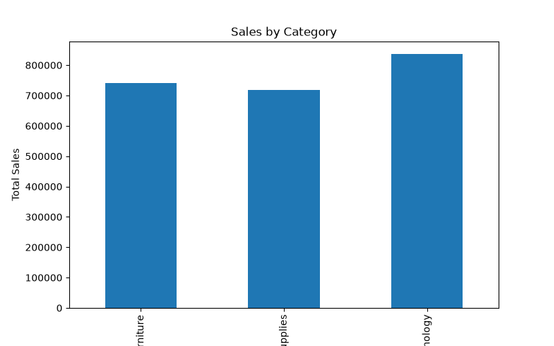
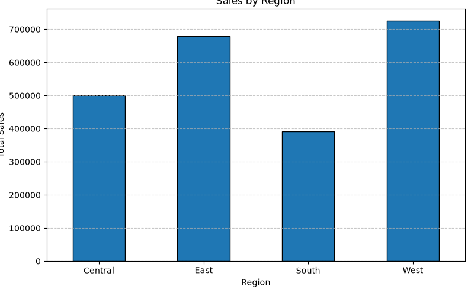
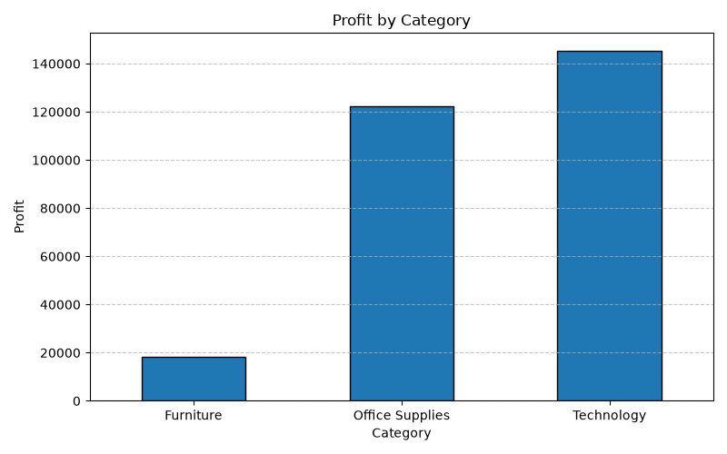
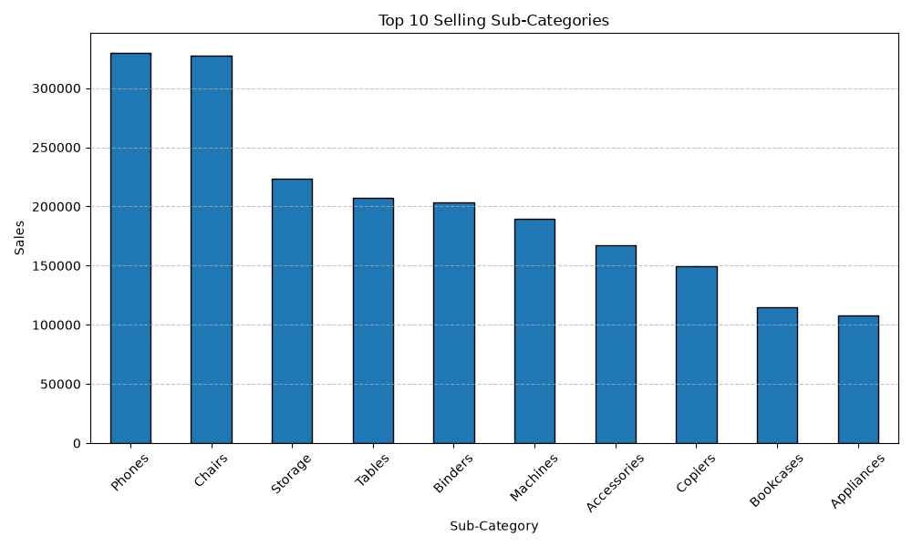
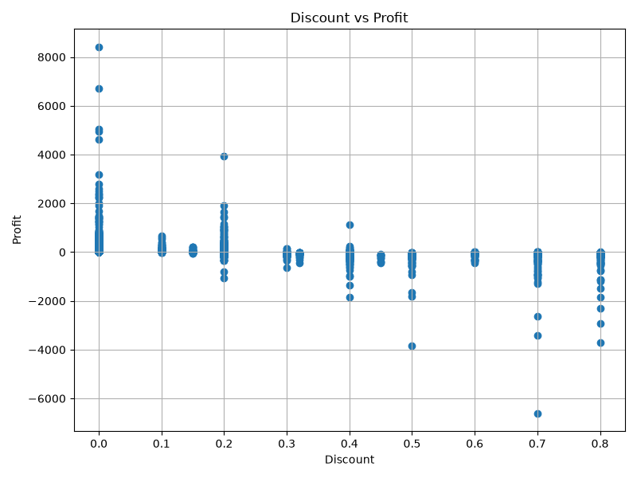

# 📊 Sales Data Analysis using Python

## 📌 Overview

This project analyzes a retail sales dataset using Python to extract meaningful business insights through data cleaning, exploratory data analysis (EDA), and visualization.

The project demonstrates the use of Python libraries such as Pandas and Matplotlib to analyze sales performance, profit trends, and regional business performance.

---

## 🛠 Technologies Used

- Python
- Pandas
- NumPy
- Matplotlib

---

## 📂 Dataset

- Sample Superstore Dataset
- Records: 9,994
- Features: 13

---

## 📈 Features

- Data Cleaning
  - Removed duplicate records

- Exploratory Data Analysis (EDA)
  - Dataset information
  - Descriptive statistics

- Business Analysis
  - Total Sales
  - Total Profit
  - Average Sales
  - Average Profit

- Category Analysis
  - Sales by Category
  - Profit by Category

- Regional Analysis
  - Sales by Region

- Sub-Category Analysis
  - Top 10 Selling Sub-Categories

- Correlation Analysis
  - Discount vs Profit

---

## 📊 Visualizations

The project includes the following visualizations:

- Sales by Category
- Sales by Region
- Profit by Category
- Top 10 Selling Sub-Categories
- Discount vs Profit Scatter Plot

---
## 📷 Sample Output

### Sales by Category



### Sales by Region



### Profit by Category



### Top 10 Selling Sub-Categories



### Discount vs Profit


## ▶️ How to Run

Clone the repository

```bash
git clone https://github.com/swizel07/Sales-Data-Analysis-Python1.git
```

Install dependencies

```bash
pip install pandas numpy matplotlib
```

Run the project

```bash
python analysis.py
```

---

## 📁 Project Structure

```
Sales_Data_Analysis/
│
├── analysis.py
├── SampleSuperstore.csv
├── README.md
├── sales_by_category.png
├── sales_by_region.png
├── profit_by_category.png
├── top10_subcategories.png
└── discount_vs_profit.png
```

---

## 🔍 Key Insights

- Technology generated the highest sales among all product categories.
- The West region achieved the highest overall sales.
- Office Supplies generated strong profits despite lower sales than Technology.
- High discounts often resulted in reduced or negative profit.

---

## 👨‍💻 Author

**Swizel Mojes Correia**

Electronics and Communication Engineering  
NMAM Institute of Technology